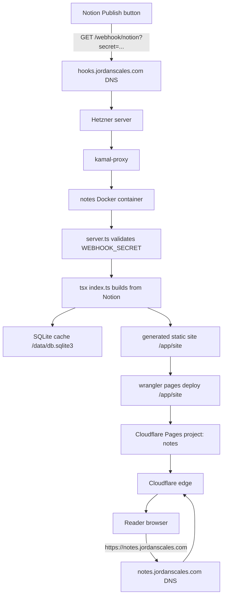

## notes

Turn a [Notion](https://notion.so) database into static site. @jdan uses this to power [notes.jordanscales.com](https://notes.jordanscales.com).


### usage

As a heads up, this barely works at all. It may not handle HTML escaping correctly. Do not run on untrusted input.

1. [Create a new Notion integration](https://developers.notion.com/docs/getting-started#step-1-create-an-integration)
1. Create a new database and note it's ID from the address bar
   - `https://www.notion.so/[username]/[your database ID, copy this!]?v=[ignore this]`
   - Add a column called "Filename" to set the output filename for a card. This is required for an `index.html`.

1. [Share that database with your new integration](https://developers.notion.com/docs/getting-started#step-2-share-a-database-with-your-integration)
1. Run the script

```sh
git clone https://github.com/jdan/cards.git
npm i
NOTION_SECRET=[your token here] NOTION_DATABASE_ID=[your id here] TWITTER_HANDLE=yourHandle npm run build
npx serve build   # build/ contains everything you need
# localhost:5000 now shows your cards
```

### config

Configuration is provided via environment variables, a [`.env` file, or a config file in the `.env` format](https://github.com/motdotla/dotenv#what-rules-does-the-parsing-engine-follow). To specify a config file, set the `CONFIG=path/to/your/file.env` env var. Here's an example:

```shell
# recipes.env
TWITTER_HANDLE=jitl
OG_IMAGE=https://jake.tl/images/jake-pleasant.jpg
BASE_URL=/recipes
NOTION_SECRET=secret_XXXXXXX
NOTION_DATABASE_ID=a3aa29a6b2f242d1b4cf86fb578a5eea
```

Then to use the config, run:

```shell
CONFIG=./recipes.env npm run build
```

Take a look at the top 100 lines or so of index.ts to see what env vars are available.

### notes deployment

The notes deployment has two roles:

1. Hetzner runs this app as a Docker container behind the existing `kamal-proxy`. It receives the protected Notion webhook, runs builds, and keeps a local generated copy in `/opt/notes/site`.
2. Cloudflare Pages serves the public static site at the edge. After a successful webhook build, the Hetzner container deploys `/opt/notes/site` to Cloudflare Pages when Cloudflare env vars are configured.

Runtime state on Hetzner:

```shell
/opt/notes/.env     # NOTION_* config and WEBHOOK_SECRET
/opt/notes/site     # generated static site
/opt/notes/data     # sqlite cache
```

The Notion button should request the Hetzner webhook hostname, not the public Cloudflare Pages hostname:

```text
https://<webhook-host>/webhook/notion?secret=<WEBHOOK_SECRET>
```

The server also accepts the secret in an `x-webhook-secret` header. Unauthenticated webhook calls return `401`.

Recommended hostnames:

```text
notes.jordanscales.com        # public site, points to Cloudflare Pages
hooks.jordanscales.com        # webhook server, points to Hetzner
```

#### Architecture overview



When you click Publish, Notion requests `https://hooks.jordanscales.com/webhook/notion?secret=<WEBHOOK_SECRET>`. That hostname points to the Hetzner server, where `kamal-proxy` terminates and routes the request to the `notes` Docker container.

`server.ts` authenticates the request using either the `secret` query parameter or the `x-webhook-secret` header. Invalid requests return `401`; valid requests start a build and immediately return a JSON response indicating that the build has started.

The container runs the normal build entrypoint, `tsx index.ts`. The build reads Notion using `NOTION_SECRET` and `NOTION_DATABASE_ID`, uses the SQLite cache at `/data/db.sqlite3`, and writes static HTML and assets into `/app/site`. On the Hetzner host, that directory is backed by `/opt/notes/site`.

After the build succeeds, `server.ts` deploys `/app/site` to Cloudflare Pages with Wrangler when `CLOUDFLARE_PAGES_PROJECT_NAME` is configured. Wrangler uses the Cloudflare values in `/opt/notes/.env`, including `CLOUDFLARE_API_TOKEN`, `CLOUDFLARE_ACCOUNT_ID`, `CLOUDFLARE_PAGES_PROJECT_NAME`, and `CLOUDFLARE_PAGES_BRANCH`.

Cloudflare creates a new Pages deployment for the `notes` project. Since deployments use branch `main`, Cloudflare treats the deployment as production and serves it through the custom domain `notes.jordanscales.com`.

Readers visiting `https://notes.jordanscales.com/` hit Cloudflare Pages, not Hetzner. The Hetzner container still keeps and can serve a local generated copy as a fallback, but the intended public browsing path is Cloudflare edge.

#### Cloudflare Pages setup

Install dependencies locally if needed:

```shell
npm install
```

Log in with Wrangler and create the Pages project once:

```shell
npx wrangler login
npx wrangler pages project create notes --production-branch main
```

If the project already exists, skip the create command. The project name can be anything, but it must match `CLOUDFLARE_PAGES_PROJECT_NAME` below.

Create a Cloudflare API token for Hetzner. It needs permission to deploy Pages for the account. Use the narrowest token Cloudflare allows for Pages deployments; if account selection is ambiguous, also set `CLOUDFLARE_ACCOUNT_ID`.

Add these values to `/opt/notes/.env` on Hetzner:

```shell
CLOUDFLARE_API_TOKEN=<cloudflare-api-token>
CLOUDFLARE_ACCOUNT_ID=<cloudflare-account-id> # optional unless Wrangler needs it
CLOUDFLARE_PAGES_PROJECT_NAME=notes
CLOUDFLARE_PAGES_BRANCH=main
```

Manual deploy from an already-built local `build/` directory:

```shell
CLOUDFLARE_PAGES_PROJECT_NAME=notes npm run deploy:cloudflare
```

Manual deploy from Hetzner's generated site directory:

```shell
ssh hetzner 'docker exec notes npx wrangler pages deploy /app/site --project-name notes --branch main'
```

#### DNS cutover

1. Add `notes.jordanscales.com` as a custom domain on the Cloudflare Pages project.
2. Point `notes.jordanscales.com` DNS to Cloudflare Pages using Cloudflare's generated target.
3. Point a separate hostname, for example `hooks.jordanscales.com`, to the Hetzner server.
4. Deploy the Hetzner service with `NOTES_WEBHOOK_HOST=hooks.jordanscales.com npm run deploy:notes`.
5. Update the Notion webhook/button URL to `https://hooks.jordanscales.com/webhook/notion?secret=<WEBHOOK_SECRET>`.

The Hetzner container still serves static files as a fallback, but readers should hit Cloudflare Pages after DNS cutover.

Useful checks:

```shell
curl -I https://notes.jordanscales.com/
curl https://hooks.jordanscales.com/healthz
ssh hetzner 'docker logs --tail 100 notes'
ssh hetzner 'docker exec kamal-proxy kamal-proxy list'
```

To deploy source changes to the running `notes` service:

```shell
npm run deploy:notes
```

The deploy script syncs source to `/opt/notes`, preserves remote `.env`, rebuilds the Docker image, restarts the `notes` container, and re-registers the route with `kamal-proxy`. It intentionally does not use the nested `build/` git repo. Set `NOTES_WEBHOOK_HOST` when deploying if the Hetzner route should use a hostname other than `notes.jordanscales.com`.
